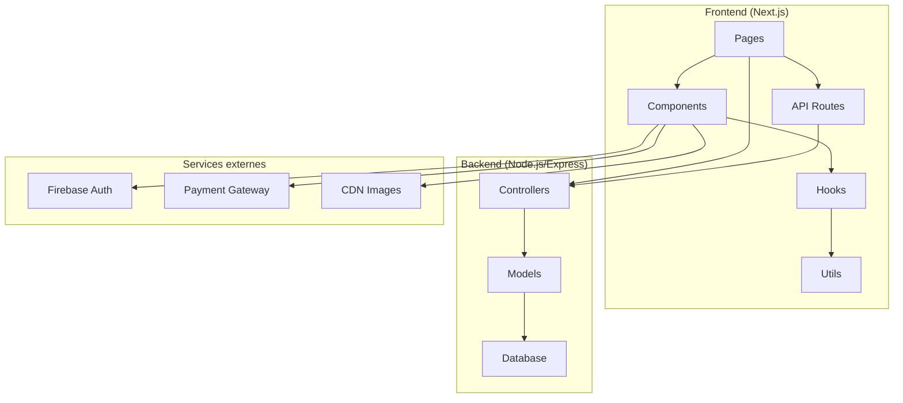

# 📖 1. Introduction et mise en contexte

> **Temps de lecture** : 10-15 minutes

## 🎯 Présentation du projet

### Qu'est-ce qu'AFROVIBZ ?

**AFROVIBZ** est une plateforme e-commerce moderne inspirée de SHEIN, spécialement conçue pour le marché africain. Notre mission est de démocratiser la mode en Afrique en proposant :

- 🛍️ **Une expérience d'achat fluide** : Interface intuitive et responsive
- 🌍 **Des produits adaptés** : Mode africaine contemporaine
- 💳 **Paiements sécurisés** : Solutions de paiement locales
- 🚚 **Logistique optimisée** : Livraison rapide en Afrique
- 📱 **Multi-plateforme** : Web, mobile, et applications natives

### Objectifs métier

1. **Expansion géographique** : Couvrir tous les pays d'Afrique
2. **Expérience utilisateur** : Rivaliser avec les meilleures plateformes e-commerce
3. **Performance** : Temps de chargement < 3 secondes
4. **Conversion** : Optimiser le taux de conversion des visiteurs
5. **Fidélisation** : Programme de fidélité et personnalisation

---

## 🛠️ Stack technique

### Frontend

| Technologie       | Version | Rôle                   | Pourquoi ce choix ?                  |
| ----------------- | ------- | ---------------------- | ------------------------------------ |
| **Next.js**       | 15.4.4  | Framework React        | SSR/SSG, performance, SEO            |
| **React**         | 18      | UI Library             | Écosystème mature, communauté active |
| **TypeScript**    | 5       | Typage statique        | Qualité du code, DX améliorée        |
| **Tailwind CSS**  | 3.4.17  | Framework CSS          | Développement rapide, cohérence      |
| **Framer Motion** | 10.18.0 | Animations             | Expérience utilisateur fluide        |
| **React Query**   | 5.17.9  | Gestion d'état serveur | Cache intelligent, synchronisation   |

### Outils de développement

| Outil        | Rôle                | Configuration                   |
| ------------ | ------------------- | ------------------------------- |
| **ESLint**   | Linting             | Règles strictes pour la qualité |
| **Prettier** | Formatage           | Code cohérent                   |
| **Sharp**    | Optimisation images | Performance web                 |
| **Firebase** | Services cloud      | Auth, storage, analytics        |

### Pourquoi cette stack ?

1. **Performance** : Next.js offre un excellent SSR/SSG
2. **SEO** : Essentiel pour l'e-commerce
3. **Développement rapide** : Tailwind + composants réutilisables
4. **Scalabilité** : Architecture modulaire et maintenable
5. **Écosystème** : Outils matures et bien documentés

---

## 🏗️ Architecture globale

### Vue d'ensemble

### Séparation des responsabilités

#### Frontend (Next.js)

- **Pages** : Routes et rendu des vues
- **Components** : Interface utilisateur réutilisable
- **Hooks** : Logique métier et gestion d'état
- **Utils** : Fonctions utilitaires
- **API Routes** : Endpoints frontend

#### Backend (Node.js/Express)

- **Controllers** : Logique métier
- **Models** : Structure des données
- **Middleware** : Authentification, validation
- **Routes** : Définition des endpoints

#### Services externes

- **Firebase** : Authentification, storage
- **Payment Gateway** : Paiements sécurisés
- **CDN** : Optimisation des images

---

## 📚 Glossaire

### Termes techniques

| Terme       | Définition                   | Exemple dans le projet                 |
| ----------- | ---------------------------- | -------------------------------------- |
| **SSR**     | Server-Side Rendering        | Pages rendues côté serveur pour le SEO |
| **SSG**     | Static Site Generation       | Pages statiques pour la performance    |
| **CSR**     | Client-Side Rendering        | Interactivité côté client              |
| **HOC**     | Higher-Order Component       | Composant qui enveloppe un autre       |
| **Hook**    | Fonction React personnalisée | `useAuth`, `useCart`                   |
| **Context** | Partage d'état global        | `AuthContext`, `CartContext`           |

### Termes métier

| Terme          | Définition                       | Contexte                        |
| -------------- | -------------------------------- | ------------------------------- |
| **SKU**        | Stock Keeping Unit               | Identifiant unique d'un produit |
| **Conversion** | Transformation visiteur → client | Objectif principal              |
| **Funnel**     | Parcours d'achat                 | Étapes vers la conversion       |
| **AOV**        | Average Order Value              | Panier moyen                    |
| **LTV**        | Lifetime Value                   | Valeur client sur la durée      |
| **Churn**      | Taux de désabonnement            | Perte de clients                |

### Abréviations courantes

- **UI** : User Interface (Interface utilisateur)
- **UX** : User Experience (Expérience utilisateur)
- **API** : Application Programming Interface
- **CRUD** : Create, Read, Update, Delete
- **JWT** : JSON Web Token (Authentification)
- **SEO** : Search Engine Optimization
- **CDN** : Content Delivery Network

---

## 🎯 Prochaines étapes

Maintenant que vous avez une vue d'ensemble du projet, vous pouvez :

1. **🚀 [Passer au guide de démarrage](./02-getting-started.md)** pour installer et configurer votre environnement
2. **🏗️ [Explorer l'architecture](./03-architecture.md)** pour comprendre l'organisation du code
3. **🧩 [Découvrir les composants](./04-components.md)** pour voir comment coder dans ce projet

---

**💡 Conseil** : Gardez cette page ouverte pendant vos premières semaines. Elle vous servira de référence !

