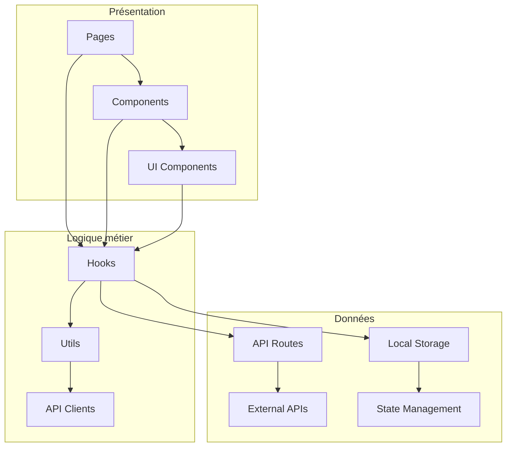
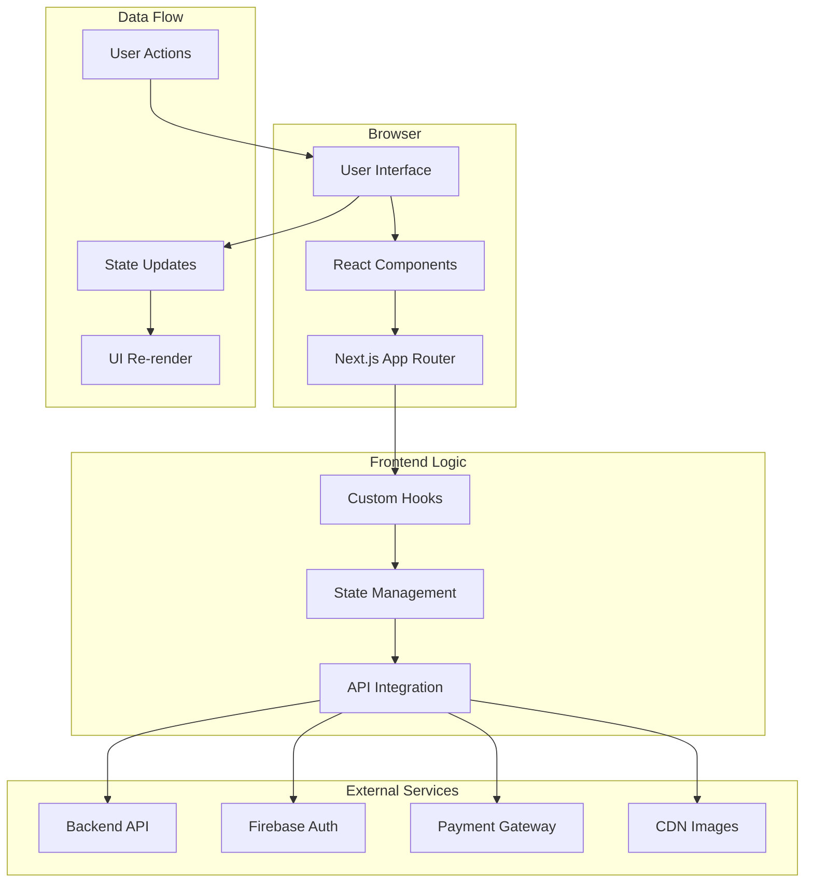
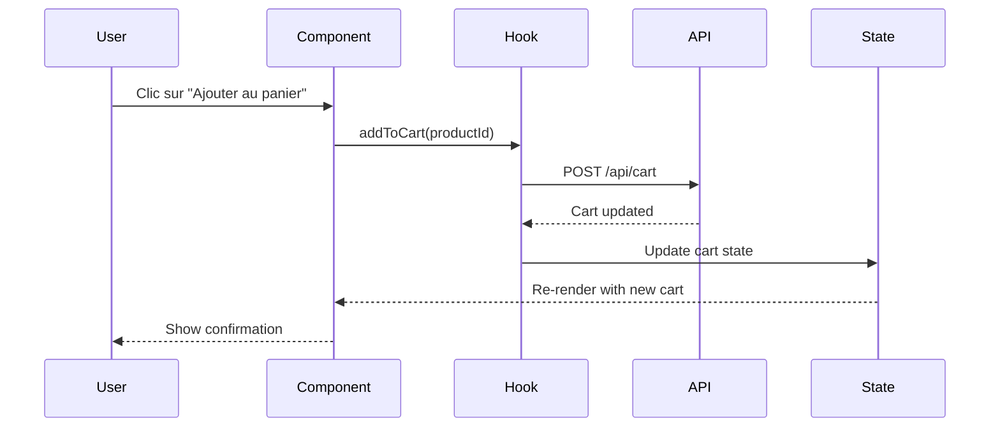

# 🏗️ 3. Architecture et structure du code

> **Temps de lecture** : 20-30 minutes

## 📁 Arborescence des dossiers

### Vue d'ensemble

```
frontend/
├── 📁 src/
│   ├── 📁 app/                    # App Router Next.js 13+
│   │   ├── 📁 admin/             # Pages d'administration
│   │   ├── 📁 api/               # API Routes
│   │   ├── 📁 auth/              # Pages d'authentification
│   │   ├── 📁 cart/              # Pages du panier
│   │   ├── 📁 checkout/          # Pages de commande
│   │   ├── 📁 client/            # Pages client
│   │   ├── 📁 orders/            # Pages de commandes
│   │   ├── 📁 product/           # Pages de produits
│   │   ├── 📁 products/          # Liste des produits
│   │   ├── 📁 profile/           # Pages de profil
│   │   ├── globals.css           # Styles globaux
│   │   ├── layout.tsx            # Layout principal
│   │   └── page.tsx              # Page d'accueil
│   ├── 📁 components/            # Composants réutilisables
│   │   ├── 📁 admin/             # Composants admin
│   │   ├── 📁 auth/              # Composants d'auth
│   │   ├── 📁 cart/              # Composants de panier
│   │   ├── 📁 checkout/          # Composants de commande
│   │   ├── 📁 HeroSection/       # Section héro
│   │   ├── 📁 invoice/           # Composants de facture
│   │   ├── 📁 layout/            # Composants de layout
│   │   ├── 📁 product/           # Composants de produit
│   │   └── 📁 ui/                # Composants UI de base
│   ├── 📁 lib/                   # Utilitaires et configurations
│   │   ├── 📁 api/               # Clients API
│   │   ├── 📁 data/              # Données statiques
│   │   ├── 📁 firebase/          # Configuration Firebase
│   │   ├── 📁 hooks/             # Hooks personnalisés
│   │   └── 📁 utils/             # Fonctions utilitaires
│   └── 📁 types/                 # Types TypeScript
├── 📁 docs/                      # Documentation
├── 📄 package.json               # Dépendances et scripts
├── 📄 next.config.js             # Configuration Next.js
├── 📄 tailwind.config.js         # Configuration Tailwind
└── 📄 tsconfig.json              # Configuration TypeScript
```

### Détail des dossiers principaux

#### 📁 `src/app/` - App Router Next.js

```typescript
// Structure App Router
app/
├── layout.tsx          # Layout racine (toujours présent)
├── page.tsx           # Page d'accueil (/)
├── globals.css        # Styles globaux
├── favicon.ico        # Icône du site
├── admin/             # Routes /admin/*
├── auth/              # Routes /auth/*
├── products/          # Routes /products/*
└── product/[id]/      # Routes dynamiques /product/123
```

**Avantages de l'App Router :**
- ✅ **Performance** : Chargement plus rapide
- ✅ **SEO** : Meilleur référencement
- ✅ **Simplicité** : Structure intuitive
- ✅ **Server Components** : Rendu côté serveur par défaut

#### 📁 `src/components/` - Composants réutilisables

```typescript
components/
├── ui/                # Composants de base (Button, Input, etc.)
├── layout/            # Composants de mise en page
├── product/           # Composants spécifiques aux produits
├── cart/              # Composants du panier
├── auth/              # Composants d'authentification
└── admin/             # Composants d'administration
```

**Organisation par domaine :**
- **ui/** : Composants génériques réutilisables
- **layout/** : Composants de structure (Header, Footer, etc.)
- **[domaine]/** : Composants spécifiques à un domaine métier

#### 📁 `src/lib/` - Utilitaires et configurations

```typescript
lib/
├── api/               # Clients API et configurations
├── hooks/             # Hooks personnalisés React
├── utils/             # Fonctions utilitaires
├── firebase/          # Configuration Firebase
└── data/              # Données statiques et mocks
```

---

## 📝 Conventions de nommage

### Fichiers et dossiers

| Type | Convention | Exemple | Explication |
|------|------------|---------|-------------|
| **Composants** | PascalCase | `ProductCard.tsx` | Composants React |
| **Pages** | kebab-case | `product-details.tsx` | Pages Next.js |
| **Hooks** | camelCase | `useProduct.ts` | Hooks personnalisés |
| **Utils** | camelCase | `formatPrice.ts` | Fonctions utilitaires |
| **Types** | PascalCase | `Product.ts` | Types TypeScript |
| **Constants** | UPPER_SNAKE_CASE | `API_ENDPOINTS.ts` | Constantes |

### Variables et fonctions

```typescript
// ✅ Bonnes pratiques
const productList = [];           // camelCase pour les variables
const fetchProducts = () => {};   // camelCase pour les fonctions
const ProductCard = () => {};     // PascalCase pour les composants
const API_BASE_URL = '...';      // UPPER_SNAKE_CASE pour les constantes

// ❌ À éviter
const ProductList = [];           // PascalCase pour une variable
const product_card = [];          // snake_case
const fetch_products = () => {};  // snake_case
```

### Imports et exports

```typescript
// ✅ Imports organisés
import React from 'react';
import { useState, useEffect } from 'react';

// Imports externes
import { motion } from 'framer-motion';
import { toast } from 'react-hot-toast';

// Imports internes
import { Button } from '@/components/ui/Button';
import { useAuth } from '@/lib/hooks/useAuth';
import { formatPrice } from '@/lib/utils';

// ✅ Exports nommés préférés
export const ProductCard = () => {};
export const useProduct = () => {};
export const formatPrice = (price: number) => {};

// ✅ Export par défaut pour les pages
export default function ProductPage() {}
```

---

## 🎯 Séparation des responsabilités

### Principe de responsabilité unique

Chaque fichier a une responsabilité claire et unique :

```typescript
// ✅ Bon : Un composant = une responsabilité
// ProductCard.tsx - Afficher un produit
export const ProductCard = ({ product }: ProductCardProps) => {
  return (
    <div className="product-card">
      
      <h3>{product.name}</h3>
      <p>{product.price}</p>
    </div>
  );
};

// ✅ Bon : Un hook = une logique métier
// useProduct.ts - Gérer la logique produit
export const useProduct = (productId: string) => {
  const [product, setProduct] = useState(null);
  const [loading, setLoading] = useState(true);
  
  useEffect(() => {
    fetchProduct(productId).then(setProduct);
  }, [productId]);
  
  return { product, loading };
};

// ✅ Bon : Une utilitaire = une fonction pure
// formatPrice.ts - Formater les prix
export const formatPrice = (price: number, currency = 'EUR') => {
  return new Intl.NumberFormat('fr-FR', {
    style: 'currency',
    currency
  }).format(price);
};
```

### Organisation par couches



---

## 🏛️ Diagramme d'architecture

### Architecture globale du frontend



### Flux de données typique



---

## 🔧 Configuration et setup

### Configuration Next.js

```javascript
// next.config.js
/** @type {import('next').NextConfig} */
const nextConfig = {
  // Optimisation des images
  images: {
    domains: ['firebasestorage.googleapis.com'],
    formats: ['image/webp', 'image/avif'],
  },
  
  // Variables d'environnement
  env: {
    CUSTOM_KEY: process.env.CUSTOM_KEY,
  },
  
  // Redirections
  async redirects() {
    return [
      {
        source: '/old-page',
        destination: '/new-page',
        permanent: true,
      },
    ];
  },
};

module.exports = nextConfig;
```

### Configuration Tailwind CSS

```javascript
// tailwind.config.js
/** @type {import('tailwindcss').Config} */
module.exports = {
  content: [
    './src/pages/**/*.{js,ts,jsx,tsx,mdx}',
    './src/components/**/*.{js,ts,jsx,tsx,mdx}',
    './src/app/**/*.{js,ts,jsx,tsx,mdx}',
  ],
  theme: {
    extend: {
      colors: {
        primary: {
          50: '#fef7ee',
          500: '#f97316',
          900: '#c2410c',
        },
      },
      fontFamily: {
        sans: ['Inter', 'sans-serif'],
      },
    },
  },
  plugins: [],
};
```

---

## 🎯 Prochaines étapes

Maintenant que vous comprenez l'architecture :

1. **🧩 [Découvrir les composants](./04-components.md)** pour voir comment coder des composants
2. **🧭 [Comprendre le routing](./05-routing.md)** pour naviguer dans l'application
3. **📊 [Gérer l'état](./06-state-management.md)** pour comprendre la gestion des données

---

<div align="center">

**💡 Conseil** : Gardez cette architecture en tête quand vous codez. Elle vous aidera à placer vos fichiers au bon endroit !

</div> 