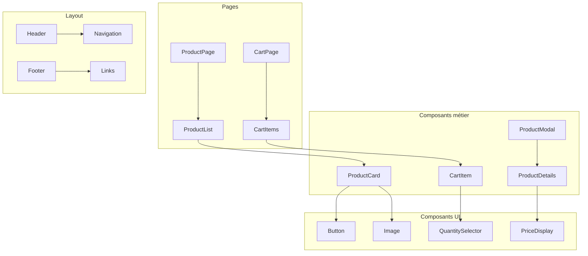

# 🧩 4. Composants et patterns

> **Temps de lecture** : 45-60 minutes

## 🏗️ Anatomie d'un composant

### Structure type d'un composant

```typescript
// ✅ Composant bien structuré
import React, { useState, useEffect } from 'react';
import { motion } from 'framer-motion';
import { toast } from 'react-hot-toast';

// Types
interface ProductCardProps {
  product: Product;
  onAddToCart?: (productId: string) => void;
  variant?: 'default' | 'compact';
  className?: string;
}

// Composant principal
export const ProductCard: React.FC<ProductCardProps> = ({
  product,
  onAddToCart,
  variant = 'default',
  className = '',
}) => {
  // État local
  const [isLoading, setIsLoading] = useState(false);
  const [isFavorite, setIsFavorite] = useState(false);

  // Effets
  useEffect(() => {
    // Vérifier si le produit est en favori
    checkFavoriteStatus(product.id);
  }, [product.id]);

  // Handlers
  const handleAddToCart = async () => {
    if (!onAddToCart) return;

    setIsLoading(true);
    try {
      await onAddToCart(product.id);
      toast.success('Produit ajouté au panier !');
    } catch (error) {
      toast.error('Erreur lors de l\'ajout au panier');
    } finally {
      setIsLoading(false);
    }
  };

  const handleToggleFavorite = () => {
    setIsFavorite(!isFavorite);
    toast.success(isFavorite ? 'Retiré des favoris' : 'Ajouté aux favoris');
  };

  // Rendu conditionnel
  if (!product) {
    return <div className="loading-skeleton">Chargement...</div>;
  }

  // Rendu principal
  return (
    <motion.div
      className={`product-card ${variant} ${className}`}
      initial={{ opacity: 0, y: 20 }}
      animate={{ opacity: 1, y: 0 }}
      whileHover={{ scale: 1.02 }}
      transition={{ duration: 0.2 }}
    >
      {/* Image du produit */}
      <div className="product-image">
        
        <button
          onClick={handleToggleFavorite}
          className="favorite-btn"
          aria-label={isFavorite ? 'Retirer des favoris' : 'Ajouter aux favoris'}
        >
          <HeartIcon filled={isFavorite} />
        </button>
      </div>

      {/* Informations du produit */}
      <div className="product-info">
        <h3 className="product-title">{product.name}</h3>
        <p className="product-price">{formatPrice(product.price)}</p>

        {/* Actions */}
        <div className="product-actions">
          <Button
            onClick={handleAddToCart}
            disabled={isLoading}
            variant="primary"
            size="sm"
          >
            {isLoading ? 'Ajout...' : 'Ajouter au panier'}
          </Button>
        </div>
      </div>
    </motion.div>
  );
};

// Composant par défaut
export default ProductCard;
```

### Éléments clés d'un bon composant

1. **📝 Types bien définis** : Interface claire des props
2. **🎯 Responsabilité unique** : Un composant = une fonction
3. **🔄 État local** : Gestion des interactions utilisateur
4. **⚡ Performance** : Optimisations (memo, useCallback)
5. **♿ Accessibilité** : ARIA labels, navigation clavier
6. **🎨 Styling** : Classes Tailwind cohérentes
7. **🐛 Gestion d'erreurs** : États d'erreur et loading

---

## 🌳 Hiérarchie des composants

### Structure en couches



### Exemples de hiérarchie

#### Page de produits

```typescript
// ProductPage (Page)
export default function ProductPage() {
  return (
    <Layout>
      <ProductList>
        <ProductCard />
        <ProductCard />
        <ProductCard />
      </ProductList>
    </Layout>
  );
}

// ProductList (Composant métier)
export const ProductList = ({ products }) => {
  return (
    <div className="grid grid-cols-1 md:grid-cols-3 gap-6">
      {products.map(product => (
        <ProductCard key={product.id} product={product} />
      ))}
    </div>
  );
};

// ProductCard (Composant métier)
export const ProductCard = ({ product }) => {
  return (
    <div className="product-card">
      <Image src={product.image} alt={product.name} />
      <Button onClick={handleAddToCart}>Ajouter</Button>
    </div>
  );
};
```

---

## 🔧 Patterns de composition

### 1. Compound Components

```typescript
// ✅ Pattern Compound Components
const ProductCard = ({ children, ...props }) => {
  return (
    <div className="product-card" {...props}>
      {children}
    </div>
  );
};

ProductCard.Image = ({ src, alt }) => (
  
);

ProductCard.Title = ({ children }) => (
  <h3 className="product-title">{children}</h3>
);

ProductCard.Price = ({ price }) => (
  <p className="product-price">{formatPrice(price)}</p>
);

ProductCard.Actions = ({ children }) => (
  <div className="product-actions">{children}</div>
);

// Utilisation
<ProductCard>
  <ProductCard.Image src={product.image} alt={product.name} />
  <ProductCard.Title>{product.name}</ProductCard.Title>
  <ProductCard.Price price={product.price} />
  <ProductCard.Actions>
    <Button>Ajouter au panier</Button>
  </ProductCard.Actions>
</ProductCard>
```

### 2. Render Props

```typescript
// ✅ Pattern Render Props
interface ProductDataProps {
  productId: string;
  children: (data: { product: Product; loading: boolean; error: Error }) => React.ReactNode;
}

export const ProductData: React.FC<ProductDataProps> = ({ productId, children }) => {
  const [product, setProduct] = useState<Product | null>(null);
  const [loading, setLoading] = useState(true);
  const [error, setError] = useState<Error | null>(null);

  useEffect(() => {
    fetchProduct(productId)
      .then(setProduct)
      .catch(setError)
      .finally(() => setLoading(false));
  }, [productId]);

  return <>{children({ product, loading, error })}</>;
};

// Utilisation
<ProductData productId="123">
  {({ product, loading, error }) => {
    if (loading) return <Spinner />;
    if (error) return <ErrorMessage error={error} />;
    return <ProductCard product={product} />;
  }}
</ProductData>
```

### 3. Higher-Order Components (HOC)

```typescript
// ✅ HOC pour l'authentification
interface WithAuthProps {
  isAuthenticated: boolean;
  user: User | null;
}

export const withAuth = <P extends WithAuthProps>(
  Component: React.ComponentType<P>
) => {
  return (props: Omit<P, keyof WithAuthProps>) => {
    const { user, isAuthenticated } = useAuth();

    return (
      <Component
        {...(props as P)}
        isAuthenticated={isAuthenticated}
        user={user}
      />
    );
  };
};

// Utilisation
const ProtectedComponent = withAuth(({ user, isAuthenticated }) => {
  if (!isAuthenticated) return <LoginPrompt />;
  return <UserProfile user={user} />;
});
```

---

## 🎯 Gestion des props

### Validation des props

```typescript
// ✅ Props bien typées avec validation
interface ButtonProps {
  // Props obligatoires
  children: React.ReactNode;
  onClick: () => void;

  // Props optionnelles avec valeurs par défaut
  variant?: 'primary' | 'secondary' | 'outline';
  size?: 'sm' | 'md' | 'lg';
  disabled?: boolean;
  loading?: boolean;
  className?: string;
}

export const Button: React.FC<ButtonProps> = ({
  children,
  onClick,
  variant = 'primary',
  size = 'md',
  disabled = false,
  loading = false,
  className = '',
}) => {
  // Validation des props
  if (loading && disabled) {
    console.warn('Button: loading et disabled ne peuvent pas être true simultanément');
  }

  const baseClasses = 'btn';
  const variantClasses = {
    primary: 'btn-primary',
    secondary: 'btn-secondary',
    outline: 'btn-outline',
  };
  const sizeClasses = {
    sm: 'btn-sm',
    md: 'btn-md',
    lg: 'btn-lg',
  };

  return (
    <button
      onClick={onClick}
      disabled={disabled || loading}
      className={`
        ${baseClasses}
        ${variantClasses[variant]}
        ${sizeClasses[size]}
        ${className}
      `}
    >
      {loading ? <Spinner size="sm" /> : children}
    </button>
  );
};
```

### Props spreading et composition

```typescript
// ✅ Props spreading intelligent
interface CardProps extends React.HTMLAttributes<HTMLDivElement> {
  variant?: 'default' | 'elevated' | 'outlined';
  children: React.ReactNode;
}

export const Card: React.FC<CardProps> = ({
  variant = 'default',
  children,
  className = '',
  ...restProps // Spread des props HTML restantes
}) => {
  const variantClasses = {
    default: 'bg-white shadow-sm',
    elevated: 'bg-white shadow-lg',
    outlined: 'bg-white border border-gray-200',
  };

  return (
    <div
      className={`card ${variantClasses[variant]} ${className}`}
      {...restProps} // Props HTML (onClick, data-*, etc.)
    >
      {children}
    </div>
  );
};
```

---

## 🔄 Exemples de refactoring

### Avant : Composant monolithique

```typescript
// ❌ Composant trop complexe
export const ProductPage = () => {
  const [products, setProducts] = useState([]);
  const [loading, setLoading] = useState(true);
  const [error, setError] = useState(null);
  const [filters, setFilters] = useState({});
  const [sortBy, setSortBy] = useState('name');
  const [cart, setCart] = useState([]);

  // 100+ lignes de logique...

  return (
    <div>
      {/* 200+ lignes de JSX */}
    </div>
  );
};
```

### Après : Composants séparés

```typescript
// ✅ Composants séparés et réutilisables
export const ProductPage = () => {
  return (
    <Layout>
      <ProductFilters />
      <ProductList />
      <CartSidebar />
    </Layout>
  );
};

// Composant de filtres
export const ProductFilters = () => {
  const { filters, setFilters } = useProductFilters();

  return (
    <div className="filters">
      <FilterCategory />
      <FilterPrice />
      <FilterBrand />
    </div>
  );
};

// Composant de liste
export const ProductList = () => {
  const { products, loading, error } = useProducts();

  if (loading) return <ProductSkeleton />;
  if (error) return <ErrorMessage error={error} />;

  return (
    <div className="product-grid">
      {products.map(product => (
        <ProductCard key={product.id} product={product} />
      ))}
    </div>
  );
};
```

### Avant : Logique mélangée

```typescript
// ❌ Logique métier dans le composant
export const ProductCard = ({ product }) => {
  const [isFavorite, setIsFavorite] = useState(false);

  const handleFavorite = async () => {
    try {
      const response = await fetch('/api/favorites', {
        method: 'POST',
        body: JSON.stringify({ productId: product.id }),
      });
      if (response.ok) {
        setIsFavorite(!isFavorite);
      }
    } catch (error) {
      console.error('Erreur:', error);
    }
  };

  return (
    <div>
      <button onClick={handleFavorite}>
        {isFavorite ? '❤️' : '🤍'}
      </button>
    </div>
  );
};
```

### Après : Hook personnalisé

```typescript
// ✅ Logique extraite dans un hook
export const useFavorite = (productId: string) => {
  const [isFavorite, setIsFavorite] = useState(false);
  const [loading, setLoading] = useState(false);

  const toggleFavorite = async () => {
    setLoading(true);
    try {
      await addToFavorites(productId);
      setIsFavorite(!isFavorite);
      toast.success('Favori mis à jour');
    } catch (error) {
      toast.error('Erreur lors de la mise à jour');
    } finally {
      setLoading(false);
    }
  };

  return { isFavorite, loading, toggleFavorite };
};

// Composant simplifié
export const ProductCard = ({ product }) => {
  const { isFavorite, loading, toggleFavorite } = useFavorite(product.id);

  return (
    <div>
      <button
        onClick={toggleFavorite}
        disabled={loading}
      >
        {isFavorite ? '❤️' : '🤍'}
      </button>
    </div>
  );
};
```

---

## 🎯 Prochaines étapes

Maintenant que vous maîtrisez les composants :

1. **🧭 [Comprendre le routing](./05-routing.md)** pour naviguer dans l'application
2. **📊 [Gérer l'état](./06-state-management.md)** pour comprendre la gestion des données
3. **🎨 [Styling et UI](./07-styling.md)** pour créer de belles interfaces

---

<div align="center">

**💡 Conseil** : Commencez par créer des composants simples, puis complexifiez progressivement. La réutilisabilité est la clé !

</div>
