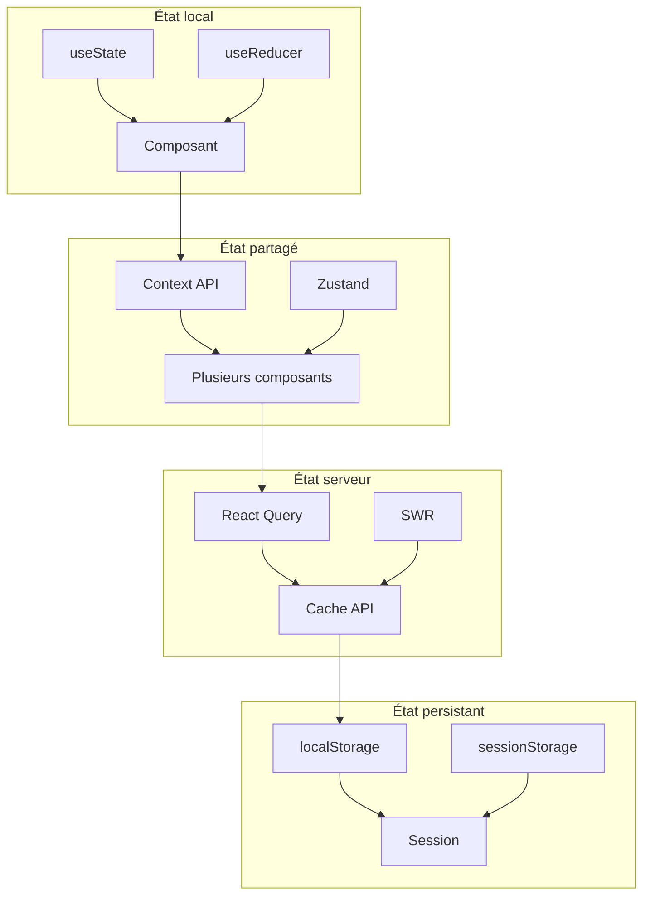

# 📊 6. Gestion d'état et données

> **Temps de lecture** : 30-45 minutes

## 🎯 Stratégie globale

### Hiérarchie de l'état



### Quand utiliser quoi ?

| Type d'état | Quand l'utiliser | Exemple |
|-------------|------------------|---------|
| **useState** | État local simple | Formulaire, toggle, compteur |
| **useReducer** | État complexe | Panier, authentification |
| **Context** | État partagé | Thème, langue, utilisateur |
| **React Query** | Données serveur | Produits, commandes |
| **localStorage** | Persistance | Préférences, panier |

---

## 🔄 État local vs global

### État local avec useState

```typescript
// ✅ État local simple
export const ProductCard = ({ product }) => {
  const [isFavorite, setIsFavorite] = useState(false);
  const [isLoading, setIsLoading] = useState(false);

  const handleFavorite = async () => {
    setIsLoading(true);
    try {
      await toggleFavorite(product.id);
      setIsFavorite(!isFavorite);
    } catch (error) {
      console.error('Erreur:', error);
    } finally {
      setIsLoading(false);
    }
  };

  return (
    <div className="product-card">
      <button 
        onClick={handleFavorite}
        disabled={isLoading}
      >
        {isFavorite ? '❤️' : '🤍'}
      </button>
    </div>
  );
};
```

### État complexe avec useReducer

```typescript
// ✅ État complexe avec useReducer
interface CartState {
  items: CartItem[];
  total: number;
  loading: boolean;
  error: string | null;
}

type CartAction =
  | { type: 'ADD_ITEM'; payload: CartItem }
  | { type: 'REMOVE_ITEM'; payload: string }
  | { type: 'UPDATE_QUANTITY'; payload: { id: string; quantity: number } }
  | { type: 'CLEAR_CART' }
  | { type: 'SET_LOADING'; payload: boolean }
  | { type: 'SET_ERROR'; payload: string | null };

const cartReducer = (state: CartState, action: CartAction): CartState => {
  switch (action.type) {
    case 'ADD_ITEM': {
      const existingItem = state.items.find(item => item.id === action.payload.id);
      
      if (existingItem) {
        return {
          ...state,
          items: state.items.map(item =>
            item.id === action.payload.id
              ? { ...item, quantity: item.quantity + 1 }
              : item
          ),
        };
      }
      
      return {
        ...state,
        items: [...state.items, { ...action.payload, quantity: 1 }],
      };
    }
    
    case 'REMOVE_ITEM':
      return {
        ...state,
        items: state.items.filter(item => item.id !== action.payload),
      };
    
    case 'UPDATE_QUANTITY':
      return {
        ...state,
        items: state.items.map(item =>
          item.id === action.payload.id
            ? { ...item, quantity: action.payload.quantity }
            : item
        ),
      };
    
    case 'CLEAR_CART':
      return {
        ...state,
        items: [],
        total: 0,
      };
    
    case 'SET_LOADING':
      return {
        ...state,
        loading: action.payload,
      };
    
    case 'SET_ERROR':
      return {
        ...state,
        error: action.payload,
      };
    
    default:
      return state;
  }
};

// Hook personnalisé pour le panier
export const useCart = () => {
  const [state, dispatch] = useReducer(cartReducer, {
    items: [],
    total: 0,
    loading: false,
    error: null,
  });

  const addItem = (item: CartItem) => {
    dispatch({ type: 'ADD_ITEM', payload: item });
  };

  const removeItem = (itemId: string) => {
    dispatch({ type: 'REMOVE_ITEM', payload: itemId });
  };

  const updateQuantity = (itemId: string, quantity: number) => {
    dispatch({ type: 'UPDATE_QUANTITY', payload: { id: itemId, quantity } });
  };

  const clearCart = () => {
    dispatch({ type: 'CLEAR_CART' });
  };

  return {
    ...state,
    addItem,
    removeItem,
    updateQuantity,
    clearCart,
  };
};
```

### État global avec Context API

```typescript
// ✅ Context pour l'authentification
interface AuthContextType {
  user: User | null;
  isAuthenticated: boolean;
  login: (email: string, password: string) => Promise<void>;
  logout: () => void;
  loading: boolean;
}

const AuthContext = createContext<AuthContextType | undefined>(undefined);

export const AuthProvider: React.FC<{ children: React.ReactNode }> = ({ 
  children 
}) => {
  const [user, setUser] = useState<User | null>(null);
  const [loading, setLoading] = useState(true);

  useEffect(() => {
    // Vérifier l'authentification au chargement
    checkAuthStatus();
  }, []);

  const checkAuthStatus = async () => {
    try {
      const token = localStorage.getItem('auth-token');
      if (token) {
        const userData = await fetchUser(token);
        setUser(userData);
      }
    } catch (error) {
      localStorage.removeItem('auth-token');
    } finally {
      setLoading(false);
    }
  };

  const login = async (email: string, password: string) => {
    setLoading(true);
    try {
      const { user: userData, token } = await loginAPI(email, password);
      localStorage.setItem('auth-token', token);
      setUser(userData);
    } catch (error) {
      throw error;
    } finally {
      setLoading(false);
    }
  };

  const logout = () => {
    localStorage.removeItem('auth-token');
    setUser(null);
  };

  const value = {
    user,
    isAuthenticated: !!user,
    login,
    logout,
    loading,
  };

  return (
    <AuthContext.Provider value={value}>
      {children}
    </AuthContext.Provider>
  );
};

// Hook pour utiliser le contexte
export const useAuth = () => {
  const context = useContext(AuthContext);
  if (context === undefined) {
    throw new Error('useAuth must be used within an AuthProvider');
  }
  return context;
};
```

---

## 🌐 Intégration API

### Configuration React Query

```typescript
// ✅ Configuration React Query
import { QueryClient, QueryClientProvider } from '@tanstack/react-query';
import { ReactQueryDevtools } from '@tanstack/react-query-devtools';

const queryClient = new QueryClient({
  defaultOptions: {
    queries: {
      staleTime: 5 * 60 * 1000, // 5 minutes
      cacheTime: 10 * 60 * 1000, // 10 minutes
      retry: 3,
      refetchOnWindowFocus: false,
    },
    mutations: {
      retry: 1,
    },
  },
});

export const QueryProvider: React.FC<{ children: React.ReactNode }> = ({ 
  children 
}) => {
  return (
    <QueryClientProvider client={queryClient}>
      {children}
      <ReactQueryDevtools initialIsOpen={false} />
    </QueryClientProvider>
  );
};
```

### Hooks personnalisés pour l'API

```typescript
// ✅ Hook pour les produits
export const useProducts = (filters?: ProductFilters) => {
  return useQuery({
    queryKey: ['products', filters],
    queryFn: () => fetchProducts(filters),
    staleTime: 5 * 60 * 1000, // 5 minutes
  });
};

export const useProduct = (productId: string) => {
  return useQuery({
    queryKey: ['product', productId],
    queryFn: () => fetchProduct(productId),
    enabled: !!productId,
  });
};

export const useCreateProduct = () => {
  const queryClient = useQueryClient();
  
  return useMutation({
    mutationFn: createProduct,
    onSuccess: (newProduct) => {
      // Invalider le cache des produits
      queryClient.invalidateQueries({ queryKey: ['products'] });
      
      // Ajouter le nouveau produit au cache
      queryClient.setQueryData(['product', newProduct.id], newProduct);
      
      toast.success('Produit créé avec succès !');
    },
    onError: (error) => {
      toast.error('Erreur lors de la création du produit');
      console.error('Create product error:', error);
    },
  });
};

export const useUpdateProduct = () => {
  const queryClient = useQueryClient();
  
  return useMutation({
    mutationFn: updateProduct,
    onSuccess: (updatedProduct) => {
      // Mettre à jour le cache
      queryClient.setQueryData(['product', updatedProduct.id], updatedProduct);
      queryClient.invalidateQueries({ queryKey: ['products'] });
      
      toast.success('Produit mis à jour !');
    },
    onError: (error) => {
      toast.error('Erreur lors de la mise à jour');
      console.error('Update product error:', error);
    },
  });
};
```

### Gestion des erreurs API

```typescript
// ✅ Hook pour gérer les erreurs API
export const useApiError = () => {
  const [error, setError] = useState<ApiError | null>(null);

  const handleError = (error: unknown) => {
    if (error instanceof Error) {
      setError({
        message: error.message,
        code: 'UNKNOWN_ERROR',
      });
    } else if (typeof error === 'object' && error !== null) {
      setError(error as ApiError);
    }
  };

  const clearError = () => {
    setError(null);
  };

  return { error, handleError, clearError };
};

// Utilisation dans un composant
export const ProductList = () => {
  const { data: products, error, isLoading } = useProducts();
  const { error: apiError, handleError } = useApiError();

  useEffect(() => {
    if (error) {
      handleError(error);
    }
  }, [error, handleError]);

  if (isLoading) return <ProductSkeleton />;
  if (apiError) return <ErrorMessage error={apiError} />;

  return (
    <div className="product-grid">
      {products?.map(product => (
        <ProductCard key={product.id} product={product} />
      ))}
    </div>
  );
};
```

---

## 💾 Cache et synchronisation

### Stratégies de cache

```typescript
// ✅ Configuration du cache par type de données
export const cacheConfig = {
  products: {
    staleTime: 5 * 60 * 1000, // 5 minutes
    cacheTime: 30 * 60 * 1000, // 30 minutes
  },
  user: {
    staleTime: 10 * 60 * 1000, // 10 minutes
    cacheTime: 60 * 60 * 1000, // 1 heure
  },
  orders: {
    staleTime: 2 * 60 * 1000, // 2 minutes
    cacheTime: 15 * 60 * 1000, // 15 minutes
  },
};

// Hooks avec configuration spécifique
export const useProducts = (filters?: ProductFilters) => {
  return useQuery({
    queryKey: ['products', filters],
    queryFn: () => fetchProducts(filters),
    ...cacheConfig.products,
  });
};

export const useUser = (userId: string) => {
  return useQuery({
    queryKey: ['user', userId],
    queryFn: () => fetchUser(userId),
    ...cacheConfig.user,
  });
};
```

### Synchronisation optimiste

```typescript
// ✅ Mise à jour optimiste
export const useOptimisticUpdate = () => {
  const queryClient = useQueryClient();
  
  return useMutation({
    mutationFn: updateProduct,
    onMutate: async (updatedProduct) => {
      // Annuler les requêtes en cours
      await queryClient.cancelQueries({ queryKey: ['product', updatedProduct.id] });
      
      // Sauvegarder l'ancienne valeur
      const previousProduct = queryClient.getQueryData(['product', updatedProduct.id]);
      
      // Mettre à jour optimistiquement
      queryClient.setQueryData(['product', updatedProduct.id], updatedProduct);
      
      // Retourner le contexte pour rollback
      return { previousProduct };
    },
    onError: (err, updatedProduct, context) => {
      // Rollback en cas d'erreur
      if (context?.previousProduct) {
        queryClient.setQueryData(['product', updatedProduct.id], context.previousProduct);
      }
    },
    onSettled: (updatedProduct) => {
      // Toujours refetch pour s'assurer de la cohérence
      queryClient.invalidateQueries({ queryKey: ['product', updatedProduct.id] });
    },
  });
};
```

### Persistance du cache

```typescript
// ✅ Persistance du cache avec localStorage
import { persistQueryClient } from '@tanstack/react-query-persist-client';
import { createSyncStoragePersister } from '@tanstack/query-sync-storage-persister';

const persister = createSyncStoragePersister({
  storage: typeof window !== 'undefined' ? window.localStorage : undefined,
});

const queryClient = new QueryClient({
  defaultOptions: {
    queries: {
      staleTime: 5 * 60 * 1000,
      cacheTime: 10 * 60 * 1000,
    },
  },
});

// Persister le cache
persistQueryClient({
  queryClient,
  persister,
  maxAge: 1000 * 60 * 60 * 24, // 24 heures
});
```

---

## 📊 Exemples pratiques

### Gestion du panier complet

```typescript
// ✅ Hook complet pour le panier
export const useCart = () => {
  const queryClient = useQueryClient();
  
  // Récupérer le panier
  const { data: cart, isLoading } = useQuery({
    queryKey: ['cart'],
    queryFn: fetchCart,
    staleTime: 1 * 60 * 1000, // 1 minute
  });

  // Ajouter au panier
  const addToCartMutation = useMutation({
    mutationFn: addToCart,
    onSuccess: (updatedCart) => {
      queryClient.setQueryData(['cart'], updatedCart);
      toast.success('Produit ajouté au panier !');
    },
    onError: () => {
      toast.error('Erreur lors de l\'ajout au panier');
    },
  });

  // Retirer du panier
  const removeFromCartMutation = useMutation({
    mutationFn: removeFromCart,
    onSuccess: (updatedCart) => {
      queryClient.setQueryData(['cart'], updatedCart);
      toast.success('Produit retiré du panier');
    },
  });

  // Mettre à jour la quantité
  const updateQuantityMutation = useMutation({
    mutationFn: updateCartItemQuantity,
    onSuccess: (updatedCart) => {
      queryClient.setQueryData(['cart'], updatedCart);
    },
  });

  return {
    cart,
    isLoading,
    addToCart: addToCartMutation.mutate,
    removeFromCart: removeFromCartMutation.mutate,
    updateQuantity: updateQuantityMutation.mutate,
    isAdding: addToCartMutation.isLoading,
    isRemoving: removeFromCartMutation.isLoading,
  };
};
```

### Gestion des favoris

```typescript
// ✅ Hook pour les favoris
export const useFavorites = () => {
  const queryClient = useQueryClient();
  
  const { data: favorites = [], isLoading } = useQuery({
    queryKey: ['favorites'],
    queryFn: fetchFavorites,
    staleTime: 5 * 60 * 1000,
  });

  const toggleFavoriteMutation = useMutation({
    mutationFn: toggleFavorite,
    onMutate: async (productId) => {
      await queryClient.cancelQueries({ queryKey: ['favorites'] });
      
      const previousFavorites = queryClient.getQueryData(['favorites']);
      
      // Mise à jour optimiste
      queryClient.setQueryData(['favorites'], (old: Product[]) => {
        const isFavorite = old.some(p => p.id === productId);
        if (isFavorite) {
          return old.filter(p => p.id !== productId);
        } else {
          return [...old, { id: productId }];
        }
      });
      
      return { previousFavorites };
    },
    onError: (err, productId, context) => {
      if (context?.previousFavorites) {
        queryClient.setQueryData(['favorites'], context.previousFavorites);
      }
    },
    onSettled: () => {
      queryClient.invalidateQueries({ queryKey: ['favorites'] });
    },
  });

  const isFavorite = (productId: string) => {
    return favorites.some(p => p.id === productId);
  };

  return {
    favorites,
    isLoading,
    toggleFavorite: toggleFavoriteMutation.mutate,
    isFavorite,
    isToggling: toggleFavoriteMutation.isLoading,
  };
};
```

---

## 🎯 Prochaines étapes

Maintenant que vous maîtrisez la gestion d'état :

1. **🎨 [Styling et UI](./07-styling.md)** pour créer de belles interfaces
2. **✅ [Bonnes pratiques](./08-best-practices.md)** pour coder proprement
3. **🐛 [Debugging](./09-debugging.md)** pour résoudre les problèmes

---

<div align="center">

**💡 Conseil** : Commencez par l'état local, puis montez en complexité. React Query est votre ami pour les données serveur !

</div> 